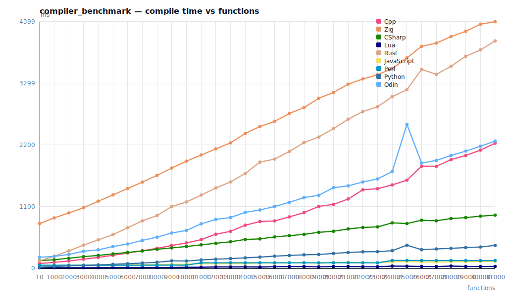
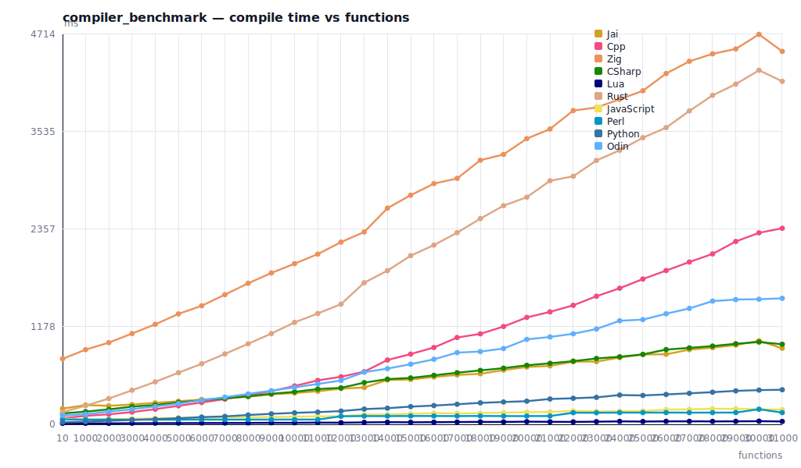

# What is it
I was wondering how different languages handle raw amount of functions with no dependencies in debug configuration.


# How to build and run
```sh
install_languages_winget.bat # install obscure stuff you likely don't have
premake vs2026
.\build\lang_benchmark.slnx  # and build
.\build\bin\benchmark.exe
```

# Benchmark



### Tools

| Language | Version |
|---|---|
| Tcc | `tcc version 0.9.28rc 2025-12-21_mob@96119149 (x86_64 Windows)` |
| Jai | `Version: beta 0.2.022, built on 15 December 2025.` |
| Cpp | `Microsoft (R) C/C++ Optimizing Compiler Version 19.50.35721 for x64` |
| Zig | `0.15.2` |
| CSharp | `5.0.0-2.25574.6 (7f327e02)` |
| Lua | `LuaJIT 2.1.1720049189 -- Copyright (C) 2005-2023 Mike Pall. https://luajit.org/` |
| Rust | `rustc 1.92.0 (ded5c06cf 2025-12-08)` |
| JavaScript | `deno 2.6.1 (stable, release, x86_64-pc-windows-msvc)` |
| Perl | `This is perl 5, version 38, subversion 2 (v5.38.2) built for x86_64-msys-thread-multi` |
| Python | `Python 3.12.10` |
| Odin | `odin version dev-2025-12-nightly:ac61f08` |


### Results (newest)

_Time in ms (lower is better)_

| Language | 10 | 1000 | 2000 | 3000 | 4000 | 5000 | 6000 | 7000 | 8000 | 9000 | 10000 | 11000 | 12000 | 13000 | 14000 | 15000 | 16000 | 17000 | 18000 | 19000 | 20000 | 21000 | 22000 | 23000 | 24000 | 25000 | 26000 | 27000 | 28000 | 29000 | 30000 | 31000 |
|---|---:|---:|---:|---:|---:|---:|---:|---:|---:|---:|---:|---:|---:|---:|---:|---:|---:|---:|---:|---:|---:|---:|---:|---:|---:|---:|---:|---:|---:|---:|---:|---:|
| Jai | 192.028 | 199.106 | 215.769 | 233.332 | 256.622 | 274.438 | 293.448 | 307.497 | 335.243 | 358.464 | 368.882 | 395.920 | 421.495 | 439.788 | 476.320 | 495.297 | 510.130 | 540.844 | 573.373 | 589.655 | 619.837 | 640.888 | 848.168 | 929.957 | 930.688 | 920.235 | 994.747 | 907.718 | 939.628 | 954.670 | 900.131 | 972.064 |
| Cpp | 80.768 | 94.443 | 119.825 | 150.158 | 186.553 | 219.229 | 259.286 | 304.660 | 348.248 | 403.455 | 452.984 | 503.680 | 567.280 | 635.963 | 700.223 | 763.742 | 853.666 | 905.223 | 1002.905 | 1076.819 | 1172.866 | 1255.798 | 1732.088 | 1880.809 | 1959.994 | 2016.618 | 2053.921 | 2069.810 | 2145.614 | 2275.937 | 2189.866 | 2262.007 |
| CSharp | 134.073 | 152.233 | 178.500 | 204.213 | 236.458 | 255.716 | 283.805 | 305.658 | 333.796 | 363.992 | 390.198 | 413.490 | 442.912 | 472.186 | 492.293 | 517.002 | 549.845 | 576.138 | 609.294 | 627.396 | 664.256 | 689.597 | 1030.054 | 1034.898 | 918.674 | 922.024 | 981.286 | 932.265 | 953.767 | 913.886 | 936.644 | 965.693 |
| Lua | 10.998 | 11.172 | 12.514 | 12.658 | 13.099 | 15.215 | 15.773 | 15.642 | 16.341 | 17.928 | 19.820 | 20.354 | 19.883 | 20.872 | 22.088 | 22.343 | 22.764 | 25.228 | 26.334 | 25.821 | 26.491 | 26.811 | 42.212 | 41.156 | 36.413 | 36.833 | 37.345 | 36.235 | 36.265 | 35.005 | 33.244 | 35.044 |
| JavaScript | 58.416 | 59.609 | 64.411 | 68.482 | 71.484 | 75.285 | 78.084 | 81.862 | 87.525 | 89.576 | 95.379 | 99.118 | 100.179 | 106.456 | 109.540 | 115.297 | 118.793 | 118.989 | 123.532 | 130.420 | 129.254 | 134.667 | 185.101 | 183.202 | 173.702 | 196.370 | 185.622 | 171.721 | 180.419 | 167.296 | 168.977 | 173.783 |
| Perl | 56.509 | 56.419 | 56.431 | 56.518 | 56.124 | 56.287 | 56.984 | 56.978 | 57.617 | 56.784 | 56.148 | 56.654 | 97.480 | 97.592 | 98.286 | 97.879 | 98.003 | 97.871 | 99.202 | 98.568 | 98.560 | 98.628 | 145.116 | 141.881 | 140.559 | 141.790 | 141.969 | 143.143 | 142.274 | 140.924 | 140.206 | 141.052 |
| Python | 22.408 | 32.688 | 43.536 | 52.688 | 64.584 | 75.394 | 83.703 | 94.883 | 111.629 | 120.612 | 131.826 | 147.981 | 157.005 | 170.388 | 183.430 | 195.241 | 211.776 | 227.062 | 238.021 | 252.340 | 264.663 | 279.228 | 386.185 | 375.789 | 394.021 | 378.423 | 396.091 | 386.259 | 389.139 | 378.579 | 393.426 | 414.898 |
| Odin | 95.215 | 118.466 | 152.866 | 180.731 | 214.552 | 248.127 | 285.257 | 332.736 | 361.395 | 413.171 | 440.053 | 485.784 | 517.660 | 573.141 | 614.659 | 655.681 | 690.638 | 775.494 | 807.168 | 859.591 | 913.755 | 1256.115 | 1420.877 | 1387.649 | 1410.599 | 1387.891 | 1372.672 | 1447.556 | 1458.177 | 1406.669 | 1454.342 | 1526.389 |
| Tcc | 10.890 | 12.201 | 13.012 | 13.367 | 14.106 | 14.204 | 15.466 | 14.944 | 16.716 | 16.442 | 16.962 | 18.623 | 19.273 | 18.949 | 19.767 | 19.878 | 20.689 | 22.125 | 23.268 | 23.742 | 23.432 | 36.442 | 36.658 | 34.782 | 32.542 | 32.035 | 29.122 | 31.586 | 32.143 | 28.397 | 29.227 | 30.190 |


# With Zig and Rust




### Table (with Zig and Rust)

_Time in ms (lower is better)_

| Language | 10 | 1000 | 2000 | 3000 | 4000 | 5000 | 6000 | 7000 | 8000 | 9000 | 10000 | 11000 | 12000 | 13000 | 14000 | 15000 | 16000 | 17000 | 18000 | 19000 | 20000 | 21000 | 22000 | 23000 | 24000 | 25000 | 26000 | 27000 | 28000 | 29000 | 30000 | 31000 |
|---|---:|---:|---:|---:|---:|---:|---:|---:|---:|---:|---:|---:|---:|---:|---:|---:|---:|---:|---:|---:|---:|---:|---:|---:|---:|---:|---:|---:|---:|---:|---:|---:|
| Jai | 189.681 | 232.887 | 223.503 | 239.491 | 259.212 | 278.580 | 299.568 | 315.300 | 333.997 | 361.568 | 378.609 | 399.747 | 431.162 | 444.806 | 535.955 | 542.153 | 572.429 | 596.557 | 610.952 | 655.498 | 693.191 | 706.396 | 756.958 | 758.448 | 806.977 | 843.381 | 846.526 | 902.705 | 926.757 | 957.642 | 1009.818 | 919.510 |
| Cpp | 74.303 | 102.521 | 121.156 | 148.240 | 183.119 | 224.025 | 263.656 | 305.053 | 351.023 | 401.059 | 463.418 | 530.932 | 574.725 | 636.688 | 777.506 | 849.106 | 928.721 | 1048.771 | 1093.614 | 1182.065 | 1292.295 | 1359.072 | 1438.478 | 1548.044 | 1645.007 | 1755.962 | 1858.602 | 1961.809 | 2059.772 | 2210.245 | 2314.578 | 2369.360 |
| Zig | 791.743 | 902.616 | 987.455 | 1097.181 | 1208.895 | 1334.617 | 1432.945 | 1567.156 | 1704.241 | 1829.339 | 1941.759 | 2057.394 | 2202.348 | 2324.791 | 2612.661 | 2769.075 | 2909.268 | 2971.985 | 3191.964 | 3262.122 | 3452.594 | 3569.276 | 3792.546 | 3829.129 | 3928.461 | 4031.385 | 4239.565 | 4387.518 | 4477.820 | 4537.306 | 4713.661 | 4507.234 |
| CSharp | 131.990 | 153.382 | 180.663 | 213.613 | 233.734 | 264.332 | 290.144 | 313.890 | 337.703 | 369.578 | 392.478 | 426.179 | 440.684 | 504.004 | 546.255 | 560.681 | 592.214 | 623.511 | 651.828 | 678.814 | 713.555 | 737.423 | 763.744 | 796.011 | 816.240 | 845.501 | 903.255 | 924.016 | 945.636 | 973.753 | 994.375 | 967.709 |
| Lua | 11.396 | 12.226 | 11.464 | 13.243 | 14.078 | 14.469 | 15.515 | 15.943 | 16.867 | 18.475 | 18.459 | 21.055 | 19.957 | 23.715 | 26.126 | 24.845 | 25.901 | 27.976 | 29.357 | 28.839 | 32.172 | 30.557 | 29.485 | 32.085 | 35.411 | 33.742 | 35.767 | 35.784 | 35.314 | 35.698 | 37.932 | 34.559 |
| Rust | 146.488 | 225.377 | 310.930 | 411.787 | 513.177 | 623.832 | 732.319 | 851.175 | 973.376 | 1096.907 | 1231.832 | 1339.710 | 1452.662 | 1711.996 | 1857.364 | 2038.703 | 2166.314 | 2316.225 | 2486.182 | 2642.878 | 2744.934 | 2943.490 | 2998.014 | 3189.176 | 3312.533 | 3464.193 | 3585.948 | 3787.662 | 3975.949 | 4112.045 | 4279.467 | 4145.356 |
| JavaScript | 68.996 | 59.792 | 63.519 | 67.563 | 72.223 | 77.712 | 79.986 | 84.498 | 85.239 | 88.134 | 92.781 | 96.464 | 98.613 | 117.163 | 119.091 | 126.358 | 135.169 | 131.649 | 134.804 | 141.070 | 146.278 | 150.411 | 162.035 | 156.348 | 158.019 | 160.164 | 177.833 | 181.030 | 187.324 | 188.184 | 182.740 | 178.073 |
| Perl | 58.405 | 56.998 | 56.510 | 56.687 | 56.100 | 56.167 | 57.562 | 57.332 | 56.836 | 57.422 | 57.654 | 57.611 | 97.386 | 99.452 | 99.343 | 100.445 | 100.379 | 99.948 | 100.879 | 99.685 | 99.577 | 100.077 | 140.235 | 139.969 | 141.269 | 141.652 | 142.183 | 141.521 | 141.275 | 142.385 | 182.497 | 141.690 |
| Python | 24.347 | 32.094 | 42.951 | 52.376 | 62.998 | 73.353 | 87.396 | 95.595 | 112.754 | 126.933 | 138.463 | 147.791 | 159.899 | 184.017 | 195.081 | 214.020 | 226.661 | 242.681 | 259.485 | 269.881 | 279.748 | 306.190 | 314.867 | 325.667 | 353.815 | 349.105 | 361.162 | 374.963 | 388.701 | 404.375 | 413.501 | 417.873 |
| Odin | 106.482 | 122.960 | 153.090 | 182.654 | 215.387 | 250.484 | 291.162 | 328.644 | 367.537 | 406.780 | 446.290 | 488.096 | 529.868 | 630.170 | 673.264 | 727.221 | 786.054 | 867.025 | 879.205 | 916.301 | 1026.685 | 1056.123 | 1094.454 | 1152.426 | 1251.861 | 1265.552 | 1336.313 | 1400.906 | 1489.292 | 1507.758 | 1512.074 | 1522.676 |


### Table (with printf)

_Time in ms (lower is better)_

| Language | 10 | 1000 | 2000 | 3000 | 4000 | 5000 | 6000 | 7000 | 8000 | 9000 | 10000 | 11000 | 12000 | 13000 | 14000 | 15000 | 16000 | 17000 | 18000 | 19000 | 20000 | 21000 | 22000 | 23000 | 24000 | 25000 | 26000 | 27000 | 28000 | 29000 | 30000 | 31000 |
|---|---:|---:|---:|---:|---:|---:|---:|---:|---:|---:|---:|---:|---:|---:|---:|---:|---:|---:|---:|---:|---:|---:|---:|---:|---:|---:|---:|---:|---:|---:|---:|---:|
| Cpp | 87.067 | 106.609 | 131.492 | 163.356 | 195.973 | 233.405 | 274.869 | 315.003 | 357.342 | 408.944 | 454.492 | 513.053 | 609.155 | 660.951 | 770.097 | 835.661 | 845.530 | 918.394 | 995.358 | 1105.933 | 1140.998 | 1237.392 | 1400.925 | 1421.145 | 1488.702 | 1573.810 | 1822.651 | 1820.043 | 1939.339 | 2013.436 | 2108.566 | 2231.990 |
| Zig | 798.444 | 900.204 | 989.094 | 1082.380 | 1198.942 | 1309.841 | 1424.726 | 1538.398 | 1659.460 | 1789.209 | 1912.128 | 2021.628 | 2130.969 | 2239.298 | 2406.689 | 2529.255 | 2621.885 | 2762.957 | 2868.344 | 3034.641 | 3136.647 | 3285.012 | 3378.174 | 3454.272 | 3563.141 | 3754.588 | 3960.786 | 4017.347 | 4134.569 | 4227.701 | 4354.503 | 4399.160 |
| CSharp | 138.414 | 153.642 | 180.630 | 209.299 | 230.981 | 257.779 | 284.478 | 310.864 | 340.766 | 365.698 | 390.077 | 420.037 | 447.413 | 474.841 | 516.268 | 525.371 | 560.902 | 583.430 | 606.906 | 643.241 | 661.481 | 703.234 | 729.986 | 739.835 | 811.614 | 799.351 | 858.204 | 848.316 | 888.605 | 905.883 | 931.322 | 949.465 |
| Lua | 11.555 | 12.101 | 11.710 | 11.766 | 12.458 | 15.830 | 16.034 | 15.473 | 16.584 | 17.002 | 19.617 | 20.444 | 24.910 | 25.453 | 26.543 | 23.325 | 29.535 | 31.877 | 32.405 | 26.502 | 34.092 | 33.408 | 29.611 | 28.555 | 40.675 | 38.296 | 34.844 | 32.382 | 41.114 | 34.511 | 34.053 | 34.634 |
| Rust | 134.096 | 217.283 | 311.692 | 414.983 | 508.784 | 601.875 | 724.061 | 848.218 | 942.629 | 1102.832 | 1185.010 | 1307.378 | 1433.478 | 1541.865 | 1692.847 | 1895.062 | 1948.912 | 2085.536 | 2244.109 | 2342.964 | 2491.352 | 2660.606 | 2797.114 | 2883.229 | 3062.056 | 3186.962 | 3548.110 | 3459.675 | 3605.206 | 3782.803 | 3896.961 | 4056.094 |
| JavaScript | 49.668 | 52.263 | 53.564 | 57.025 | 56.718 | 60.539 | 62.814 | 65.476 | 67.770 | 71.506 | 73.644 | 84.633 | 83.331 | 88.262 | 87.229 | 95.989 | 95.143 | 97.629 | 100.707 | 92.005 | 105.179 | 107.223 | 99.791 | 102.664 | 113.729 | 122.801 | 112.552 | 111.901 | 117.048 | 119.964 | 123.693 | 127.095 |
| Perl | 56.396 | 55.844 | 56.191 | 56.077 | 55.717 | 56.481 | 56.572 | 56.525 | 57.651 | 57.796 | 57.555 | 98.944 | 98.560 | 98.935 | 98.814 | 99.742 | 99.301 | 99.123 | 99.519 | 98.633 | 99.004 | 100.316 | 98.975 | 98.728 | 140.840 | 141.745 | 140.102 | 139.714 | 140.212 | 139.720 | 138.712 | 140.462 |
| Python | 21.434 | 32.818 | 44.589 | 51.188 | 62.211 | 72.299 | 83.405 | 95.019 | 108.713 | 134.075 | 130.823 | 150.839 | 163.597 | 174.441 | 187.768 | 201.490 | 218.023 | 230.218 | 242.084 | 247.599 | 265.904 | 283.438 | 295.361 | 297.327 | 315.749 | 412.710 | 333.434 | 346.542 | 357.148 | 371.050 | 380.786 | 409.968 |
| Odin | 198.474 | 213.103 | 248.973 | 304.803 | 330.704 | 389.845 | 434.329 | 498.686 | 556.791 | 630.845 | 676.802 | 794.168 | 873.458 | 907.108 | 999.227 | 1042.175 | 1105.007 | 1177.713 | 1263.560 | 1303.199 | 1438.980 | 1472.061 | 1541.420 | 1595.124 | 1725.638 | 2568.279 | 1876.541 | 1925.356 | 2013.398 | 2091.524 | 2177.325 | 2270.385 |

### Summary (newest)
- Tiny C compiler kicks ass.

### Summary (with Zig and Rust)
- Not sure what's up with Zig at this point.
- Wow, Jai is competitive with C#!
- I guess C++ is not _that_ well optimized now that we don't do `#include <stdio.h>`...

### Summary (with printf)
- Zig is really slow on Windows, x2-3 slower with `-fno-llvm` atm. It's much faster if I don't pull in `std.debug.print`. That probably makes the compiler build the whole std.
- C++ compiler is very well optimized: its compilation model makes it a requirement...
- LuaJit still goes brrr. Would be interesting to checks those claims that _v8 has been faster for years_.
- LLVM makes newer languages slow to compile (duh).
- C# is a hidden gem once again.
- Python isn't much slower to start than Perl nowdays.
- Rust is still safe.


